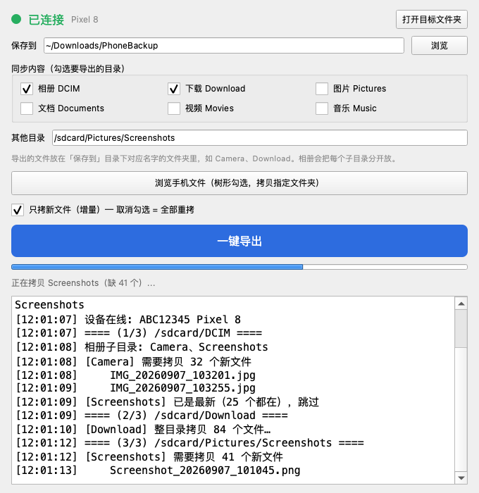

# 手机文件导出

把安卓手机上的目录**增量同步**到 Mac 的图形小工具。插上数据线、勾几个目录、点一下按钮，只拷新文件，跑完自动打开目标文件夹。

adb 已内置在 app 里，**不需要装 Android SDK、不需要装 Python、不需要敲任何命令**。



## 功能

- **一键导出**：设备检测、adb server 自救、增量比对、拷贝、通知，全部自动
- **常用目录预设**：相册 / 下载 / 图片 / 文档 / 视频 / 音乐，勾选即可
- **任意目录**：还想拉别的路径就手填，多个用中文逗号或分号隔开
- **浏览手机文件**：树形浏览 `/sdcard`，看到哪勾到哪，勾了上层自动去掉下层
- **只拷新文件**：按文件名比对，已存在的直接跳过；一个都没有新的就整目录跳过
- **状态灯**：灰=未连接 / 橙=手机没授权 / 绿=已连接并显示机型
- **连不上自动救**：点导出时如果 adb server 挂了，自动 `kill-server` → `start-server` 重试
- **跑完通知**：系统通知 + 自动打开目标文件夹

## 安装

### 方式一：直接用（推荐）

到 [Releases](../../releases) 下载 `ADBPhotoExport_mac_arm64.zip`，解压出 `手机文件导出.app`，拖进「应用程序」即可。独立 arm64 应用（M 系列芯片），内置 adb，不依赖任何环境。

> 首次打开如果提示「无法验证开发者」，在「系统设置 → 隐私与安全性」里点一次「仍要打开」即可。

### 方式二：从源码跑

```bash
git clone https://github.com/charleshuang13/adb-photo-sync.git
cd adb-photo-sync

python3 -m venv .venv
.venv/bin/pip install -r requirements.txt
.venv/bin/python main.py
```

从源码跑需要本机有 `adb`：`brew install android-platform-tools`，或放进 Android SDK 的默认路径（`~/Library/Android/sdk/platform-tools/adb`）。程序会按「内置 → SDK → Homebrew → PATH」的顺序找。

## 使用

1. 手机打开**开发者选项 → USB 调试**，插上数据线
2. 手机上弹出「允许 USB 调试吗」→ 点允许（勾选「一律允许」以后就不用再点）
3. 工具栏状态灯变绿、显示机型，说明连上了
4. 选保存目录（默认 `~/Downloads`），勾要同步的目录
5. 点「一键导出」，进度条 + 日志区实时显示在拷什么

**落点规则**：`目标目录/远端目录名`。比如勾了 `/sdcard/Download`、保存到 `~/Downloads`，文件就进 `~/Downloads/Download/`。相册 `DCIM` 是特例：会展开一级子目录，`Camera` 和 `Screenshots` 各自平铺成 `~/Downloads/Camera`、`~/Downloads/Screenshots`。

## 工作原理

- **增量判断**：远端 `find <dir> -type f` 拿全部相对路径，本地 `os.walk` 拿一份，两边一比就知道缺哪些
- **两种拷法**（`plan_transfer`）：
  - 本地目录是空的 / 勾了强制全量 / 缺失比例超过一半 → 整目录 `adb pull` 一把梭（比逐个快）
  - 否则只 `pull` 缺的那几个文件，父目录先 `mkdir`
- **大目录按 50% 阈值切**：缺一点点就逐个补，缺太多就整体拉，避免"几千个文件逐个 pull 慢到怀疑人生"
- **取消**：导出中途可以停，停之前会确认一次

## 自己打包

```bash
./build_mac.sh
# 产物：dist/手机文件导出.app + dist/手机文件导出.app.zip
```

脚本会自动建 venv、生成图标、下载内置 adb、打包、离屏冒烟验证、压缩。

## 已知限制

- **只能导出已授权的设备**。手机必须开着 USB 调试并点过「允许」，加密锁屏状态下部分目录不可读。
- **macOS arm64（M 系列）** 的预编译包。Intel Mac 需要自己 `./build_mac.sh`。
- 首次连接如果 `adb devices` 显示 `unauthorized`，在手机上重新确认一次 USB 调试授权即可。
- 无线调试（`adb pair`）不支持，走 USB。

## 开发与测试

```bash
# 纯逻辑 + 离屏 GUI 冒烟（不需要手机）
QT_QPA_PLATFORM=offscreen .venv/bin/python test_smoke.py

# 浏览对话框端到端：造一个假 adb 脚本模拟 /sdcard 目录树，无真机也能测
QT_QPA_PLATFORM=offscreen .venv/bin/python test_browse_e2e.py

# 重新生成界面截图 → docs/screenshot.png
QT_QPA_PLATFORM=offscreen .venv/bin/python screenshot.py
```

项目结构：

```
main.py            主窗口、设备轮询、增量同步 worker（QThread）
browse_dialog.py   手机文件树浏览对话框（懒加载 + 勾选去嵌套）
make_icon.py       图标生成（QPainter 绘制）
screenshot.py      生成 README 截图（模拟数据）
test_smoke.py      纯逻辑 + GUI 实例化冒烟
test_browse_e2e.py 假 adb 端到端测浏览树
build_mac.sh       一键打包 macOS 应用
```

`adb` 二进制不入库（第三方产物），`build_mac.sh` 首次运行会自动从 Google 官方仓库下载 platform-tools 并抽出 `adb`。

## 免责声明

仅供导出你自己设备上的文件使用。请遵守设备厂商与相关服务的使用条款。

## License

[MIT](LICENSE) —— 注意：打包产物内嵌的 `adb` 来自 Android SDK Platform-Tools，遵循其自身的许可（Apache 2.0）。
